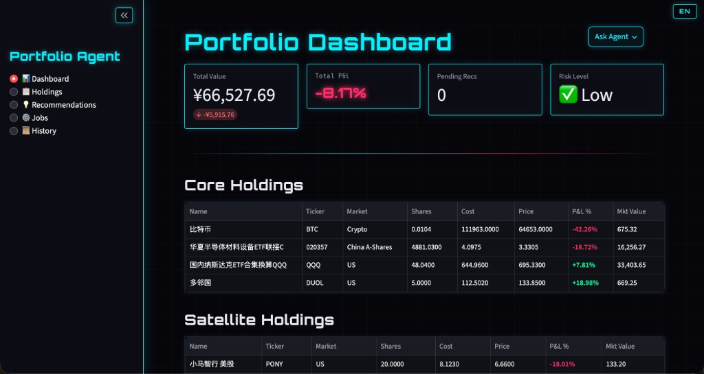
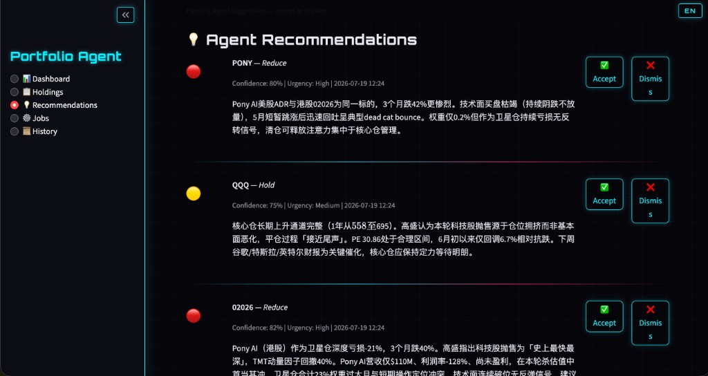
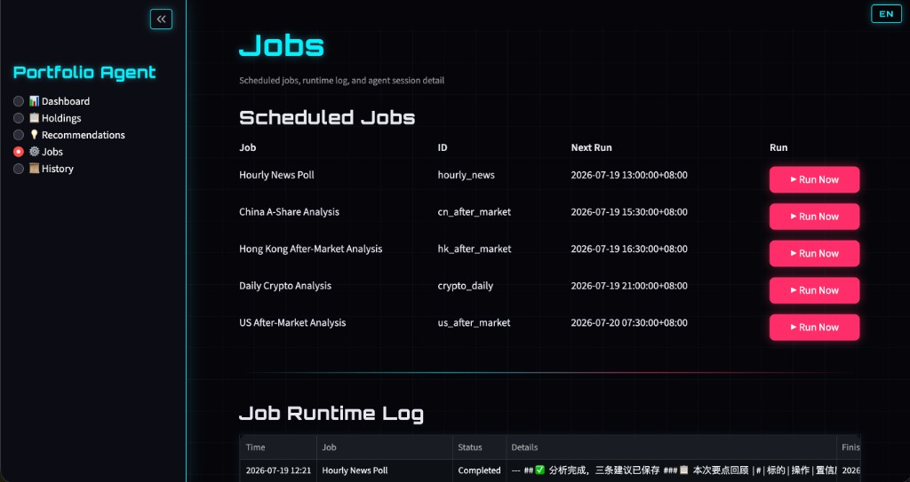
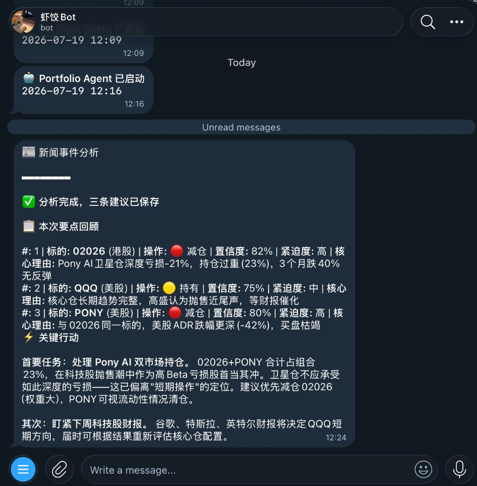

# Portfolio Agent

[中文文档](README_CN.md)

AI-powered personal portfolio management for US, China A-share, Hong Kong, and crypto holdings. It combines a Streamlit dashboard, a LangGraph tool-calling agent (DeepSeek thinking mode), live market adapters, scheduled analysis, and Telegram notifications.

## Screenshots

### Dashboard

Portfolio KPIs, core/satellite holdings, live P&L, and Ask Agent.



### Recommendations

Agent suggestions with confidence, urgency, full reasoning, Accept / Dismiss.



### Jobs

Scheduled after-market / news jobs, Run Now triggers, and runtime logs (Beijing time by default).



### Telegram

High-priority analysis pushed to your chat when jobs finish.



## Features

- **Multi-market holdings** — US / CN / HK / crypto with core-satellite allocation
- **DeepSeek thinking agent** — `deepseek-v4-pro` + thinking mode (`reasoning_effort=max`) via LangGraph
- **Live-price resilience** — cached snapshots first, then background refresh
- **Scheduled analysis** — after-market jobs + hourly news (ticker news and headlines)
- **Decision audit trail** — sessions, tool calls, recommendations, and user actions in SQLite
- **Bilingual UI** — EN / CN toggle in the top banner
- **Telegram** — optional startup and analysis notifications

## How to use

1. **Install & configure**
   ```bash
   pip install -r requirements.txt
   cp .env.example .env
   # Required: DEEPSEEK_API_KEY
   # Optional: TELEGRAM_BOT_TOKEN, TELEGRAM_CHAT_ID, APP_TIMEZONE=Asia/Shanghai
   ```

2. **Start the app**
   ```bash
   ./run.sh
   ```
   Open http://localhost:8501.

3. **Add holdings** — go to **Holdings**, add positions (core or satellite) for US / CN / HK / Crypto.

4. **Monitor the portfolio** — **Dashboard** shows total value, P&L, risk, and holdings tables. Use **Ask Agent** for ad-hoc questions.

5. **Review suggestions** — **Recommendations** lists pending actions; Accept or Dismiss each one. Full history is under **History**.

6. **Run or schedule analysis** — **Jobs** shows next run times. Click **Run Now** to trigger immediately, or wait for cron (US/CN/HK after-market, crypto daily, hourly news). Results appear in the runtime log and Agent Session Detail; Telegram notifies when configured.

## Configuration

| Variable | Required | Default |
|---|---:|---|
| `DEEPSEEK_API_KEY` | Yes | — |
| `DEEPSEEK_BASE_URL` | No | `https://api.deepseek.com/v1` |
| `DEEPSEEK_MODEL` | No | `deepseek-v4-pro` |
| `DEEPSEEK_MAX_TOKENS` | No | `65536` |
| `DEEPSEEK_REASONING_EFFORT` | No | `max` |
| `DEEPSEEK_THINKING` | No | `true` |
| `APP_TIMEZONE` | No | `Asia/Shanghai` |
| `AUTH_ENABLED` | No | `false` |
| `AUTH_PASSWORD` | If auth on | — |
| `AUTH_MAX_FAILURES` | No | `3` |
| `TELEGRAM_BOT_TOKEN` | No | notifications disabled |
| `TELEGRAM_CHAT_ID` | No | notifications disabled |

Before public deploy, set `AUTH_ENABLED=true` and a strong `AUTH_PASSWORD`. After 3 failed attempts the client IP is blacklisted in `data/ip_blacklist.json`.

## Tech Stack

| Layer | Technology |
|---|---|
| UI | Streamlit 1.33+ |
| Agent | LangGraph + LangChain |
| LLM | `DeepSeekChatOpenAI` → `deepseek-v4-pro` (thinking mode) |
| Market data | yfinance, akshare, pycoingecko, WallStreetCN |
| Persistence | SQLite + SQLAlchemy 2.0 |
| Scheduler | APScheduler |
| Notifications | Telegram Bot (optional) |
| Runtime | Python 3.9+ |

## Validation

```bash
PYTHONPATH=. python3 -m pytest tests -v
```

## Project Structure

```text
portfolio-agent/
├── adapters/           # Market / news data adapters
├── agent/              # LangGraph graph, prompts, tools, DeepSeek client
├── app/                # Streamlit UI, i18n, theme
├── db/                 # Models, repository, migrations
├── scheduler/          # Cron jobs and manual triggers
├── notifier/           # Telegram
├── docs/screenshots/   # App showcase images
├── tests/
└── .streamlit/         # Production UI config (toolbarMode=minimal)
```

## Design Documents

- [Original design](docs/superpowers/specs/2026-07-18-portfolio-agent-design.md)
- [Cyberpunk dashboard design](docs/superpowers/specs/2026-07-18-cyberpunk-ui-design.md)
